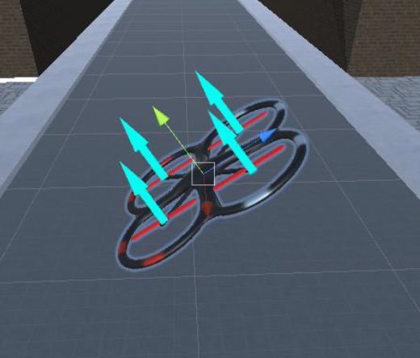
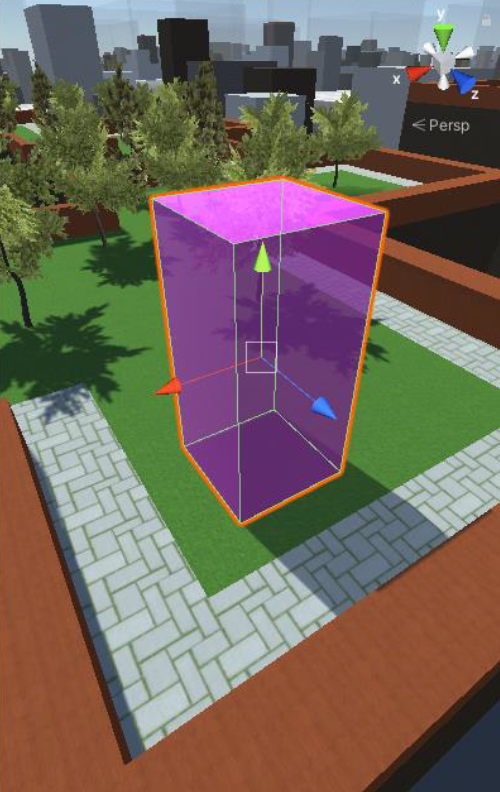
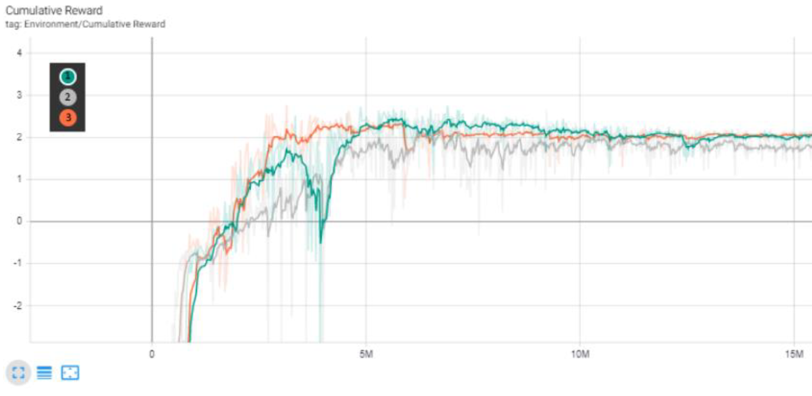
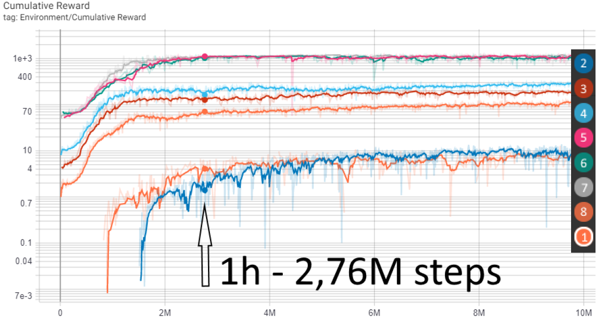

# Training a delivery drone with mlAgents



This is a university project powered by [SIGMA Clermont](https://www.sigma-clermont.fr/fr) and made by the brazilian student [Matheus Chaves D'Carvalho](https://www.linkedin.com/in/matheus-chaves-d-carvalho-estudante-n%C3%ADvel-mestrado-eu-na-sigma-clermont-34b87a196/?locale=en_US) under the guidance of the Professor Christophe Bascoul.

Mainly aiming to guide future professors and students that have interest in this area, 
this project is the development of an Artificial Intelligence capable of piloting a drone 
to a position marked with 3 coordinates (x, y, z). Two different control approaches are developed in this project, 
in the first one there is an independent stability control system and in the second one the stability control 
must be done by the artificial intelligence.

## Requirements

* [Unity](https://unity.com/)
* [ML-Agents](https://github.com/Unity-Technologies/ml-agents/)
* [Python 3.6.1 or higher](https://www.python.org/downloads/)
* [NVIDIA CUDA Toolkit 10.1](https://developer.nvidia.com/cuda-toolkit)
* [NVIDIA cuDNN for CUDA 10.1](https://developer.nvidia.com/cudnn)


## Installation

To install this project and ML-Agents training you will
need an stable version of Unity (in this moment I dont recommend the 2020 version yet, so you can download the LTS 2019 version), a clone of this repo, the ML-Agents Toolkit, the latest version of Python, CUDA Toolkit 10.1 and its appropriate cuDNN.

#### Install Unity

I recomend you to get the LTS 2019 version because it`s a stable version now. This training was last
tested on Unity 2020.1.6f1.

#### Clone this repo:


You can clone it using the command:
```sh
git clone https://github.com/MatheusChavesDCarvalho/Delivery-drone-mlAgents
```


The `Projeto Real Oficial First Control\Assets\Scenes` folder contains the `Drone_scene` scene. The same goes for the second control. If you open the scene
in Unity you will see a few errors since the ML-Agents package still needs to be added.

#### Install the Unity ML-Agents Toolkit

Detailed instructions for installing ML-Agents Toolkit can be found on the
[ml-agents repo](https://github.com/Unity-Technologies/ml-agents/blob/release_8_docs/docs/Installation.md).

#### Install the Nvidia CUDA Toolkit 10.1

Detailed instructions for installing Nvidia CUDA Toolkit can be found on the
[CUDA Toolkit Documentation](https://docs.nvidia.com/cuda/cuda-installation-guide-microsoft-windows/index.html).

#### Install the Nvidia cuDNN

Detailed instructions for installing Nvidia CUDA Toolkit can be found on the
[nvidia cuDNN Documentation](https://docs.nvidia.com/deeplearning/cudnn/install-guide/index.html#install-windows).


### Training using the Unity ML-Agents Toolkit



In this project, we used the [Unity ML-Agents Toolkit](https://github.com/Unity-Technologies/ml-agents) to train the drone to go to a certain coordinate using two differents control approaches.

The episodes end immediately when the drone touches the cube located in the target coordinates, and are limited to a maximum of 10000 steps. At the beginning of each new episode, the drone is reset to its initial position at the center of the area, and the cube is moved to a random location.

#### First control approach

At first, the idea was to teach the agent to control an already programmed drone. That is, teaching the agent to control the drone with the same commands that can be done by a human with a remote control. In this situation, a stability control must exist in advance.

The python API will receive positive rewards when:

* The distance between the target and the drone decreases.
* Drone arrives at the target coordinates.

And negative rewards when:

* Drone collides with a structure.
* The distance between the target and the drone increases.
* Also a neagtive reward each step in order to decrease the duration of each episode.

Other reward schemes may work as well or better. You should experiment!

#### Second control approach


The reason for this control without a pre-existent stability control is to apply the commands directly to the drone without going for a pre-existing control system, this way it is possible to have a faster response with less real-time processing.

This control consists of directly controlling the four propellers of the drone. But in a real drone, normally the controlled parameter can be the rotation speed of each motor with a transfer function by passing this controlled data to a PWM signal. 

While in unity, it is not enough to turn the propellers, you have to create force vectors directly on each one to simulate reality well.
For this, it is necessary to create a mathematical relationship by making the relationship between the rotation of a propeller and the force produced, also called thrust.

After some physical consideration, we got to this expression:

`𝐹(𝑁)=0,30625.𝜋(0,254)^2.(𝑉𝑟𝑜𝑡(𝑟𝑝𝑚).0,12760)^2`

Where `Vrot` is the rotation speed of a propeller and `F` is the thrust made by it in our simulation. If you want to know the complete developpement of the expression, you can find it on the file ChavesDCarvalho_ Matheus_RapportStage2A.pdf.

The python API will receive positive rewards when:

* The drone arrives at the target position;
* It maintains the inclination of the horizontal axes between -30 and 30 degrees;
* The current angular acceleration on the horizontal axes is less than the angular acceleration measured in the last iteration.

And negative rewards when:


* It collides with a structure;
* It moves away from the target;
* A negative punctuation for each step he performs in order to decrease the number of steps necessary to reach the destination;
* It does not maintain the inclination of the horizontal axes between -30 and 30 degrees;
* The current angular acceleration on the horizontal axes is greater than the previous one.

#### Using a Pre-trained Model

This project comes with a pre-trained model using the ML-Agents Toolkit. To see that behavior
in action, just go to the Prefab in the `Projeto Real Oficial First Control\Assets\MyPrefabs`. 
Then go to the gameObject called `Drone` and choose the model you want to try in the `Behavior Parameters`.
Then hit **Play** in the Unity Editor.

#### Train

You can also train the drone yourself. 
Detailed instructions on how to train using the ML-Agents Toolkit can be found on the [ml-agents repo](https://github.com/Unity-Technologies/ml-agents/blob/release_8_docs/docs/Training-ML-Agents.md).

To start training, just run this command:

`mlagents-learn config/ppo/Drone_training.yaml --run-id=[YOUR RUN ID]`

Then, press **Play** in the Unity Editor.

As the training runs, a `models` and a `summaries` folder will be automatically created in the root level of this project. As you might guess, the `models` folder stores the trained model files, and the `summaries` folder stores the event files where Tensorflow writes logs.

To monitor training, navigate into the `summaries` folder and run:

`tensorboard --logdir results --port 6006`

You can then view the live Tensorboard at `localhost:6006` on your browser.

#### Our Results

Since there is some randomness in the training process, your results might not look exactly like ours. Our reward gradually increased during training, as expected:

##### First Control Approach


##### Second Control Approach



## Support

This project is provided as-is without guarantees. Please [submit
an issue](https://github.com/Unity-Technologies/articulations-robot-demo/issues) if:
* You run into issues downloading or installing after following the instructions above.
* You extend this project in an interesting way. We may not be able to provide support, but would love to hear about it.


